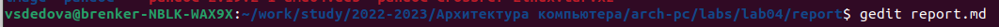

---
## Front matter
title: "Отчет по лабораторной работе №3 "
author: "Дедова Виктория Сергеевна НБИбд-01-22"

## Generic otions
lang: ru-RU
toc-title: "Содержание"

## Bibliography
bibliography: bib/cite.bib
csl: pandoc/csl/gost-r-7-0-5-2008-numeric.csl

## Pdf output format
toc: true # Table of contents
toc-depth: 2
lof: true # List of figures
lot: true # List of tables
fontsize: 12pt
linestretch: 1.5
papersize: a4
documentclass: scrreprt
## I18n polyglossia
polyglossia-lang:
  name: russian
  options:
	- spelling=modern
	- babelshorthands=true
polyglossia-otherlangs:
  name: english
## I18n babel
babel-lang: russian
babel-otherlangs: english
## Fonts
mainfont: PT Serif
romanfont: PT Serif
sansfont: PT Sans
monofont: PT Mono
mainfontoptions: Ligatures=TeX
romanfontoptions: Ligatures=TeX
sansfontoptions: Ligatures=TeX,Scale=MatchLowercase
monofontoptions: Scale=MatchLowercase,Scale=0.9
## Biblatex
biblatex: true
biblio-style: "gost-numeric"
biblatexoptions:
  - parentracker=true
  - backend=biber
  - hyperref=auto
  - language=auto
  - autolang=other*
  - citestyle=gost-numeric
## Pandoc-crossref LaTeX customization
figureTitle: "Рис."
tableTitle: "Таблица"
listingTitle: "Листинг"
lofTitle: "Список иллюстраций"
lotTitle: "Список таблиц"
lolTitle: "Листинги"
## Misc options
indent: true
header-includes:
  - \usepackage{indentfirst}
  - \usepackage{float} # keep figures where there are in the text
  - \floatplacement{figure}{H} # keep figures where there are in the text
---

# Цель работы

Целью работы является освоение процедуры оформления отчетов с помощью
легковесного языка разметки Markdown.

# Задание

1.В соответствующем каталоге сделайте отчёт по лабораторной работе No 3
в формате Markdown. В качестве отчёта необходимо предоставить отчёты
в 3 форматах: pdf, docx и md.
2. Загрузите файлы на github

# Ход работы

1. Открываем терминал, переходим в кталог курса сформированный при выполнении лабораторной работы №3,испольюзая команду:cd ~/work/study/2022-2023/"Архитектура компьютера"/arch-pc/,обновляем локальный репозиторий,скачивая изменения из удаленного репозитория с помощью команды: git pull.
{ #fig:fig1 width=70% }
 2. Переходим в каталогом с шаблоном с использованием Makefile, используя команду make,открываем файлы report.docx и report.pdf. { #fig:fig1 width=71% }
 { #fig:fig1 width=70% }
 { #fig:fig1 width=70% }
 Удаляем файлы, используя команду make clean
 { #fig:fig1 width=70% }
 { #fig:fig1 width=70% }
 3. Открываем файл report.md c помощью текстового редактора gedit
gedit report.md,внимательно изучим структуру этого файла 
{ #fig:fig1 width=70% }
{ #fig:fig1 width=70% }
4. Загружаем файлы на  Github.
{ #fig:fig1 width=70% }

 
 
 

# Выводы
На данной лабораторной работе мы освоенили процедуры оформления отчетов с помощью
легковесного языка разметки Markdown

# Список литературы{.unnumbered}

::: {#refs}
:::
